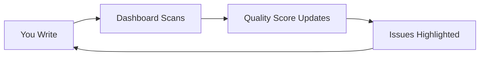

## Overview

Gemba Write provides a complete toolkit for research writing, focusing on real-time quality control, verified citations, structured drafting, and seamless exports. You get immediate feedback on your manuscript to prevent defects, ensuring publication-ready output without rework.

<Columns cols={2}>
  <Card title="Real-Time Quality" icon="zap" href="#live-quality-dashboard">
    Monitor coverage, structure, and gaps as you write.
  </Card>
  <Card title="Verified Citations" icon="book-open" href="#verified-citations">
    Search 200M+ sources with auto-DOI validation.
  </Card>
  <Card title="AI Drafting" icon="cpu" href="#structured-drafting">
    Align sections to your research question effortlessly.
  </Card>
  <Card title="Export Options" icon="download" href="#export-options">
    Generate PDF, Word, LaTeX, or Markdown for any journal.
  </Card>
</Columns>

## Live Quality Dashboard

The live quality dashboard tracks your manuscript's health in real-time. It scores coverage, structure, and potential gaps, updating as you type.

<Callout kind="tip">
  Aim for a quality score above `90%` before submission to minimize peer review issues.
</Callout>

### How It Works



Use the dashboard to spot missing citations or weak sections instantly.

<Steps>
  <Step title="Open Dashboard" icon="monitor">
    Access the side panel to view live metrics.
  </Step>
  <Step title="Review Issues" icon="alert-triangle">
    Click highlighted areas for suggestions.
  </Step>
  <Step title="Resolve Gaps" icon="check-circle">
    Add content and watch the score improve.
  </Step>
</Steps>

## Verified Citations

Generate citations from 200M+ academic sources. Gemba Write verifies DOIs and formats them correctly, preventing invalid references.

<Tabs>
  <Tab title="Insert Citation" icon="plus">
    Type your query and select from verified results.
  </Tab>
  <Tab title="Markdown Example" icon="code">
````markdown
This method improves efficiency [@doi:10.1002/anie.202015915].

References:
- Doe, J. (2021). Efficient Algorithms. Journal of Science, 15(3), 123-145. DOI: `10.1002/anie.202015915`
````
  </Tab>
  <Tab title="LaTeX Example" icon="code">
````latex
This method improves efficiency \cite{doi:10.1002/anie.202015915}.

\bibliography{references}
% Auto-generated .bib entry:
@article{doe2021efficient,
  title={Efficient Algorithms},
  author={Doe, J.},
  journal={Journal of Science},
  volume={15},
  number={3},
  pages={123--145},
  doi={10.1002/anie.202015915},
  year={2021}
}
````
  </Tab>
</Tabs>

## Structured Drafting with AI

AI assists in building structured manuscripts aligned to your research question. Outline sections, draft content, and maintain logical flow.

<Expandable title="AI Alignment Workflow" default-open="true">
  Start with your hypothesis, then let AI suggest subsections and content.

  <CodeGroup tabs="Outline,Draft">
  ```markdown
  # Hypothesis
  We test X improves Y by Z%.

  ## Methods
  - Data collection
  - Analysis pipeline
  ```
  ```markdown
  ## Results
  Figure 1 shows a `25%` improvement (p < 0.01).

  AI-suggested: Expand with statistical details.
  ```
  </CodeGroup>
</Expandable>

## Submission-Ready Exports

Export your manuscript in formats tailored to journals: PDF, Word, LaTeX, or Markdown.

<CodeGroup tabs="PDF Command,LaTeX Export">
```bash
# From Gemba Write CLI
gemba export manuscript.md --format=pdf --style=apa
# Outputs: manuscript.pdf (4.2 MB)
```
```latex
% Exports ready-to-compile LaTeX
\documentclass{article}
\usepackage[style=ieee]{biblatex}
\addbibresource{manuscript.bib}
% Full content + bibliography included
```
</CodeGroup>

<Callout kind="success">
  Exports include verified citations and quality report for reviewers.
</Callout>

## Next Steps

Experiment with these features in your free trial. Start a new manuscript to see the dashboard in action.

<Columns cols={3}>
  <Card title="Quickstart" icon="rocket" href="/quickstart">
    Set up in minutes.
  </Card>
  <Card title="Tutorials" icon="play-circle" href="/tutorials">
    Guided workflows.
  </Card>
  <Card title="Support" icon="help-circle" href="/support">
    Get help anytime.
  </Card>
</Columns>