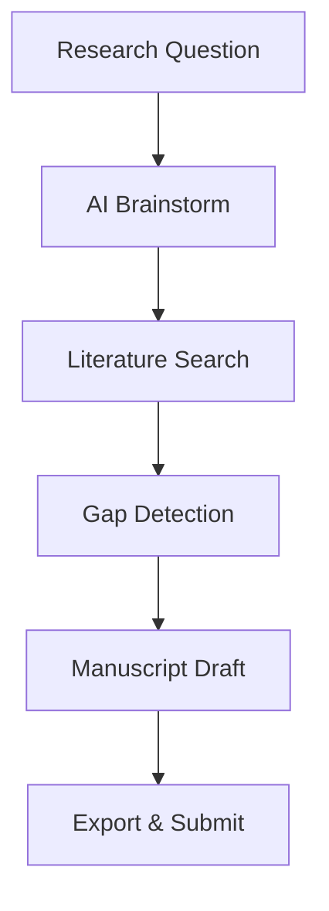

## Overview

Gemba Write provides tailored workflows that adapt to every stage of your research process. From initial brainstorming with the AI research assistant to final manuscript polishing, these tools ensure real-time quality checks and seamless progression. You gain specialized features for literature reviews, gap analysis, academic editing, and PhD writing support, reducing rework and accelerating publication-ready output.

<Callout kind="tip">
Start by selecting your research stage in the dashboard to activate the relevant workflow. This auto-configures tools like citation verification and structure alignment.
</Callout>

## Key Workflows

Explore the core workflows designed for different research needs. Each combines live quality feedback, verified citations, and structured drafting.

<Columns cols={2}>
  <Card title="AI Research Assistant" icon="zap" href="#ai-assistant">
    Brainstorm ideas, analyze data, and generate outlines with AI tailored to your field.
  </Card>
  <Card title="Literature Review" icon="book-open" href="#literature-review">
    Automate synthesis from 200M+ sources with verified DOIs and gap detection.
  </Card>
  <Card title="Manuscript Editing" icon="edit-3" href="#manuscript-editing">
    Get real-time feedback on structure, clarity, and journal compliance.
  </Card>
  <Card title="Gap Analysis & PhD Support" icon="target" href="#gap-analysis">
    Identify research gaps and build PhD chapters with aligned argumentation.
  </Card>
</Columns>

## AI Research Assistant

Use the AI assistant for brainstorming and analysis at any stage.

### Steps to Brainstorm

<Steps>
  <Step title="Select Workflow" icon="zap">
    Open the dashboard and choose `AI Research Assistant`. Enter your research question.
  </Step>
  <Step title="Generate Outline" icon="list">
    Click Generate. Review the structured outline with placeholders for citations.
  </Step>
  <Step title="Refine Ideas" icon="edit">
    Prompt the AI: `Expand on methodology for climate modeling`. Iterate until satisfied.
  </Step>
  <Step title="Export Draft" icon="download">
    Export as Markdown or LaTeX for further editing.
  </Step>
</Steps>

## Literature Review and Synthesis

Automate your review process with these platform-specific examples.

<Tabs>
  <Tab title="Initial Search" icon="search">
    Enter keywords like `quantum computing applications`. Gemba Write scans sources and suggests 50+ verified citations.
  </Tab>
  <Tab title="Synthesis" icon="layers">
    Use the auto-summarize tool to create a themed review section. Quality score updates live.
  </Tab>
  <Tab title="Export" icon="file-text">
````markdown
# Literature Review

## Quantum Computing Advances

- Smith et al. (2023) demonstrate scalable qubits [DOI verified].
- Gap: Limited real-world applications.
````
  </Tab>
</Tabs>

## Manuscript Editing and Gap Analysis

Switch to editing mode for feedback-driven improvements.

<CodeGroup tabs="Markdown,LaTeX">
```markdown
# Methods

We used a neural network model `{architecture: "Transformer"}`.

Quality issues flagged: Add citation for baseline comparison.
```
```latex
\section{Methods}

We used a neural network model \texttt{architecture: "Transformer"}.

% Quality issues flagged: Add citation for baseline comparison.
```
</CodeGroup>

<Expandable title="Advanced PhD Writing Tips" default-open="false">
For PhD chapters, enable `Gap Analysis` mode. It highlights unsubstantiated claims and suggests counterarguments. Maintain a `{quality_score > 90}` by addressing issues inline.


</Expandable>

## Best Practices

- Always verify citations before export—Gemba Write flags unconfirmed DOIs.
- Use structured prompts for AI: `Analyze gaps in X for Y context`.
- Track your quality score; aim for `>94%` to minimize peer review revisions.

<Callout kind="success">
Integrate these workflows into your daily routine for zero-defect research output.
</Callout>